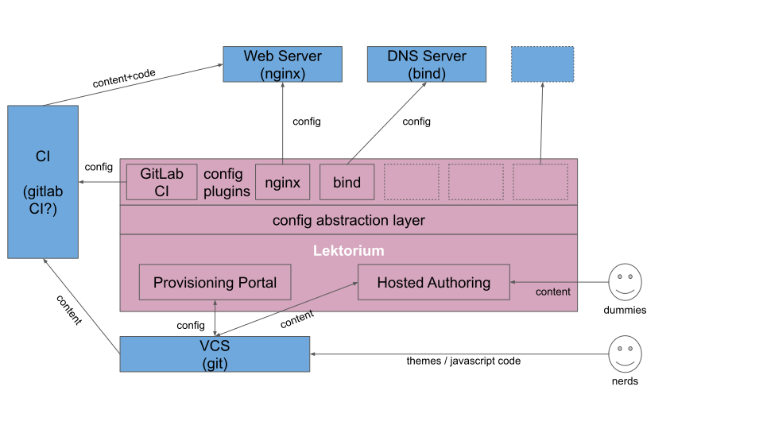

# What is Lektorium? 
Lektorium _will be_ a web content management solution for those with many little and/or similar websites. 
A typical user would be a large and loosely governed organisation with departments having a strong mandate to 
communicate externally and independently publish on the web. 

We will use Lektor (https://github.com/lektor/lektor), a great static site generator, as the source of basic content management and organisation functionality, and augment it with everything necessary for the business setting described above. 

# Design goals
If you are responsible for the web presence, corporate branding, design and consistency in communications in an organisation 
described above - may the Universe afford you the best of luck, for keeping such arrangements from becoming an uncontrollable 
zoo of technologies and designs is not easy. Lektorium should help you address some of the related pains. Our plan is: 

## 1. Separate "nerds" and "dummies"
Some users will believe that they need to modify templates, create their own CSS and JavaScript. This is totally fine. 
These _nerds_ will have direct access to the _theme_ repository and will be made responsible for the changes they make. 
Other users will only ever need to change content. These _dummies_ will have a friendly user interface that will guide them. 

## 2. All state in the repository
The only configuration or state living outside the repository is the location and credentials for the repository. 
**All** other state, config, content or anything that is expected to survive unplugging of the machine is stored in the code repository. 
Multi-user scenarios, such as collaborative content authoring, will be resolved using repository means even if _dummies_ are involved. 
In case of conflicts, a _nerd_ will be called in. 

## 3. No server-side code 
Server-side code is only interacted with using XHRs and it always speaks data, never presentation or user interaction. 
I.e. server side code will never be redirected to, produce HTML code or responses to be interpreted by the browser 
(as opposed to the users' JavaScript code). 

Server-side code is not a concern of Lektorium. Related attack vectors are made completely impossible because everything 
we are dealing with is static. Server resource issues are gone because all code is executed on the client. 

## 4. Service administrators should not have to be nerds
It should be possible to create and publish new websites, and carry out other site lifecycle using simple web interfaces.

## 5. Other than Lektor, we don't have other loyalties
Lektorium should be resonably easy to teach to work with various webservers, repositories, DNSes, clouds... 

# What will be in the box / how will it work

The basic architecture idea is that we create two things: 

- A "provisioning portal" where admins will set up which sites we have at all, who can work on their content, what
they will be called for the outside world etc. 
- A hosted authoring system that will create pre-configured Lektor instances for unsophisticated content authors
- A plugin API to turn sites' configuration stored in a VCS into configuration of whatever necessary to host these 
sites (web server, DNS zone, S3 buckets, 0auth,... etc.)    

Admins will add a site using the provisioning portal. The portal will create a repo for the site, grant access and trigger
update of whatever configs that need to be updated via the config plugins. 

Nerds will be granted access to the site's repo directly. 

Dummies will be restricted to the use of hosted authoring. All changes from the hosted authoring will be committed into 
the VCS and picked up for promotion to whatever environment by the CI. 
